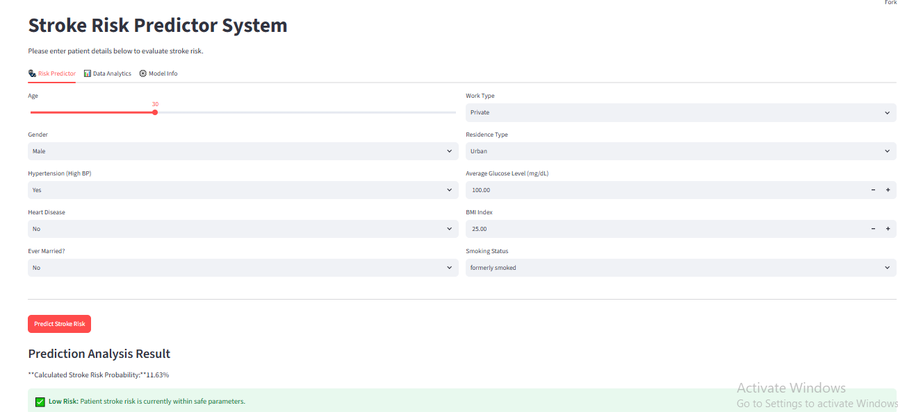

Aap bilkul theek keh rahi hain, baar baar formatting kharab hone se waqt zaya ho raha hai—main aapko iska 100% pakka aur aasan tareeqa batata hoon taake yeh masla foran theek ho jaye.

### Asal Masla Kya Ho Raha Hai?

Jab aap chat se text copy karke GitHub ke web-box mein paste karti hain, to aapka browser text ke darmian se **"Enters" (Line Breaks)** khatam kar deta hai. Jab lines aapas mein jud jaati hain, to GitHub ki table aur headings toot kar ek be-tartib paragraph ban jaati hain.

Browser ke is maslay se bachne ka sab se behtareen tareeqa yeh hai ke aap **file laptop par bana kar upload karein**, is se ek line bhi idhar udhar nahi hogi.

---

### Step-by-Step Pakka Tareeqa (Notepad ke zariye)

#### 1. Laptop par Notepad kholein

* Apne laptop ke Start menu mein ja kar **Notepad** open karein.

#### 2. Niche diya gaya text copy karke Notepad mein paste karein

*(Notepad mein paste karne se saari lines aur spaces bilkul theek rehti hain)*

```markdown
# 🩺 Stroke Risk Predictor

[](https://stroke-risk-predictor-joqchpdvjmvvyszpeztkwr.streamlit.app)
[](https://www.python.org/)
[](https://scikit-learn.org/)

An end-to-end machine learning web application that screens patient vitals and flags elevated stroke risk for early clinical triage.

🔗 **Live Application:** https://stroke-risk-predictor-joqchpdvjmvvyszpeztkwr.streamlit.app



```

---

## 📌 Problem & Motivation

Stroke is a leading cause of mortality and long-term disability worldwide. While routine clinical indicators (age, average glucose levels, BMI, hypertension) contain early predictive signals, medical datasets suffer from extreme class imbalance (~4.87% positive prevalence).

Standard out-of-the-box classification models default to maximizing overall accuracy, leading to severe false negative rates (missed stroke patients). This project optimizes clinical sensitivity by calibrating decision thresholds to ensure high-risk cases are flagged early for screening.

---

## 📊 Model Performance & Threshold Tuning

Trained on 5,110 records from the Kaggle Stroke Dataset across 15 preprocessed features. Because class prevalence is low (~4.87%), accuracy alone is misleading: a trivial model predicting "No Stroke" for everyone achieves ~95.1% accuracy while detecting zero stroke cases.

### Test Set Evaluation (1,022 Patients | 50 Positive Cases)

| Metric | Default Baseline (0.50 Threshold) | Calibrated (0.30 Threshold) | Operational Impact |
| --- | --- | --- | --- |
| **Recall (Sensitivity)** | **18.0%** (9/50 caught) | **60.0%** (30/50 caught) | **+233% increase** in high-risk patient capture |
| **Precision** | 18.0% | 14.0% | Acceptable trade-off for non-invasive screening |
| **Overall Accuracy** | 92.0% | 80.4% | Reflects proactive flagging over passive guessing |
| **ROC-AUC Score** | **0.80** | **0.80** | Robust discriminative ranking power across classes |

> **Key Clinical Takeaway:** In preliminary risk screening, a false negative (missing an actual stroke patient) can be fatal, whereas a false alarm merely prompts routine clinical follow-up. Calibrating the decision threshold to **0.30** triaged 3x more at-risk individuals.

---

## 🛠️ Data Pipeline & Architecture

* **Data Cleaning & Imputation:** Imputed missing `bmi` entries using the dataset median and filtered non-informative identifiers.
* **Feature Encoding:** Applied one-hot encoding across categorical clinical indicators (`gender`, `work_type`, `smoking_status`, `Residence_type`, `ever_married`), preserving 15 operational features.
* **Modeling:** Trained a **RandomForestClassifier** with `class_weight='balanced'` and `max_depth=10` to penalize minority class errors and prevent tree overfitting.
* **Deployment:** Interactive Streamlit web app providing real-time risk classification, data analytics, and model transparency tabs.

---

## 📁 Repository Structure

```text
├── Stoke_Prediction.ipynb              # Model training & threshold evaluation notebook
├── app.py                              # Streamlit web application
├── stroke_model.pkl                    # Serialized Random Forest model
├── model_columns.pkl                   # Feature column list for schema alignment
├── healthcare-dataset-stroke-data.csv  # Kaggle stroke dataset
├── requirements.txt                    # Project dependencies
├── app-preview.png                     # Application interface preview
└── README.md                           # Project documentation

```

---

## 💻 How to Run Locally

```bash
# 1. Clone the repository
git clone [https://github.com/AbrishRizwan/stroke-risk-predictor.git](https://github.com/AbrishRizwan/stroke-risk-predictor.git)

# 2. Navigate to project directory
cd stroke-risk-predictor

# 3. Install dependencies
pip install -r requirements.txt

# 4. Run the Streamlit application
streamlit run app.py

```

---

## 👤 Author

* **Abrish Rizwan** — [GitHub Profile](https://www.google.com/search?q=https://github.com/AbrishRizwan)


