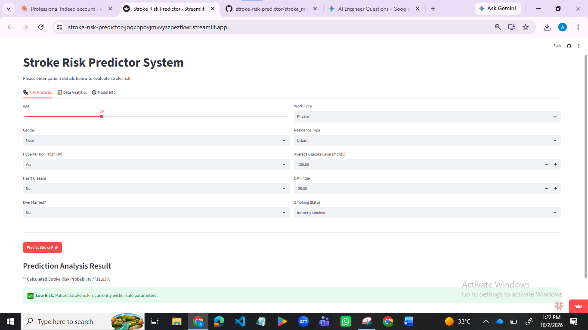

# Stroke Risk Predictor

ML web app that predicts a patient's stroke risk from basic health data, built to help flag high-risk cases early.

🔗 **Live demo:** https://stroke-risk-predictor-joqchpdvjmvvyszpeztkwr.streamlit.app



## Problem

Stroke is a leading cause of death and long-term disability, but early risk flags from basic health indicators (age, glucose level, hypertension, etc.) can help prioritize patients for further screening. This app takes patient data as input and outputs a stroke risk prediction.

## Dataset & Approach

- Public Kaggle stroke dataset — 5,110 patient records, ~4.87% stroke prevalence (highly imbalanced)
- Applied **SMOTE** to address the class imbalance, since the dataset has very few actual stroke cases
- Compared **Random Forest** and **Logistic Regression** models
- Tuned the classification threshold down to **0.30** (instead of default 0.50) — since missing a real stroke case is far costlier than a false alarm, this prioritized high recall on actual positive cases
- Built an interactive **Streamlit** UI with three tabs: risk predictor, analytics, and model info

## Tech Stack

- Python, pandas, NumPy
- scikit-learn (Random Forest, Logistic Regression, SMOTE via imbalanced-learn)
- Streamlit (UI)

## How to Run Locally

```bash
git clone [https://github.com/AbrishRizwan/stroke-risk-predictor.git](https://github.com/AbrishRizwan/stroke-risk-predictor.git)
cd stroke-risk-predictor
pip install -r requirements.txt
streamlit run app.py
